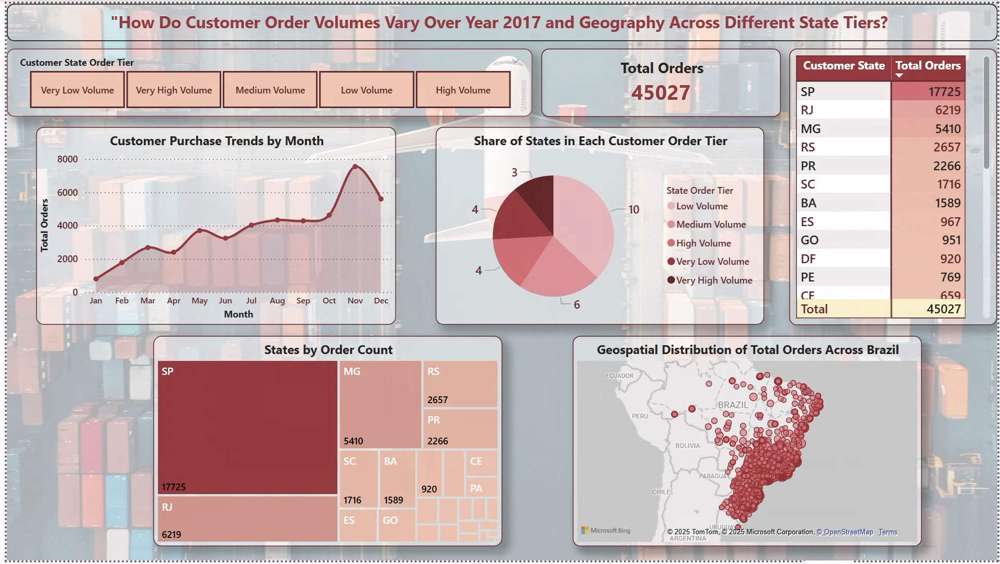
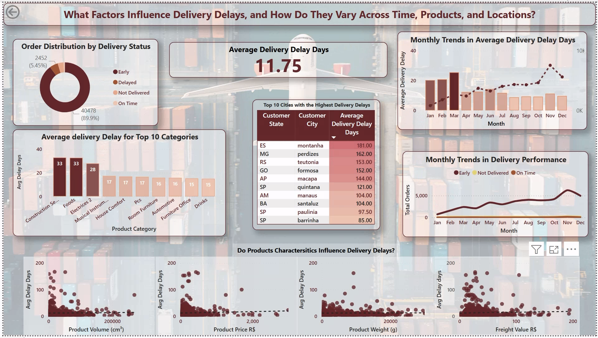
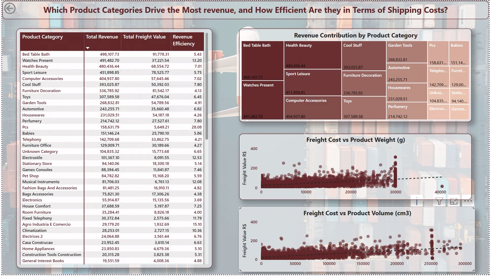
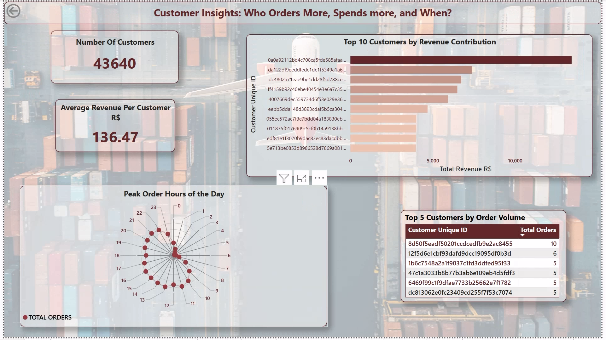

# E-Commerce Sales and Delivery Analysis (Power BI)

## Project Overview
This Power BI project explores customer behavior, product performance, delivery efficiency, and revenue trends using e-commerce marketplace data. The dashboard was built as part of a data modeling and visualization project to analyze key logistics and sales metrics across various dimensions.

## Dataset Source

The dataset used in this analysis is publicly available on Kaggle:

[Kaggle](https://www.kaggle.com/datasets/devarajv88/target-dataset)

## 📊 Dashboard Insights

This Power BI dashboard consists of five interactive report pages:

### 1. Order Volumes by State
- Visualizes monthly trends in customer purchases throughout 2017
- Highlights order volumes across Brazilian states
- Uses pie, treemap, and geospatial plots to represent regional order distribution

### 2. Delivery Delay Analysis
- Shows average delivery delay by product category and city
- Includes monthly trends in delay days and delivery performance
- Analyzes how product price, volume, weight, and freight cost relate to delays

### 3. State Revenues Overview
- Categorizes states by revenue tiers (High, Medium, Low)
- Shows revenue growth across tiers over time
- Displays order and freight volume distributions by state

### 4. Revenue by Product Categories
- Displays total revenue and freight value per product category
- Calculates revenue efficiency (revenue per freight cost)
- Visualizes freight cost vs. weight and volume using scatter plots

### 5. Customer Analysis
- Ranks customers by revenue and order volume
- Displays total customer count and average revenue per customer
- Identifies peak order times across the day

## 📷 Dashboard Previews$

### 1. Order Volumes by State 

### 2. Delivery Delay Analysis

### 3. State Revenues Overview

### 4. Revenue by Product Categories

### 5. Customer Analysis

## Files
- `E-Commerce Sales and Delivery Analysis.pbix` – Main Power BI dashboard file
- `screenshots/` – Preview images of each report page

## Tools Used
- Microsoft Power BI
- DAX (Data Analysis Expressions)
- Data Modeling
- Visual Analytics

## Note
This project was built using open-source Brazilian e-commerce dataset.  
All data has been cleaned and modeled for analysis and educational purposes.

## Author
**Suma Tata**  
MS in Data Science, University of Delaware  
